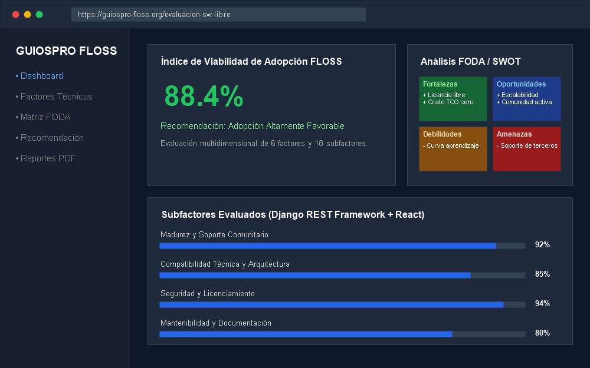
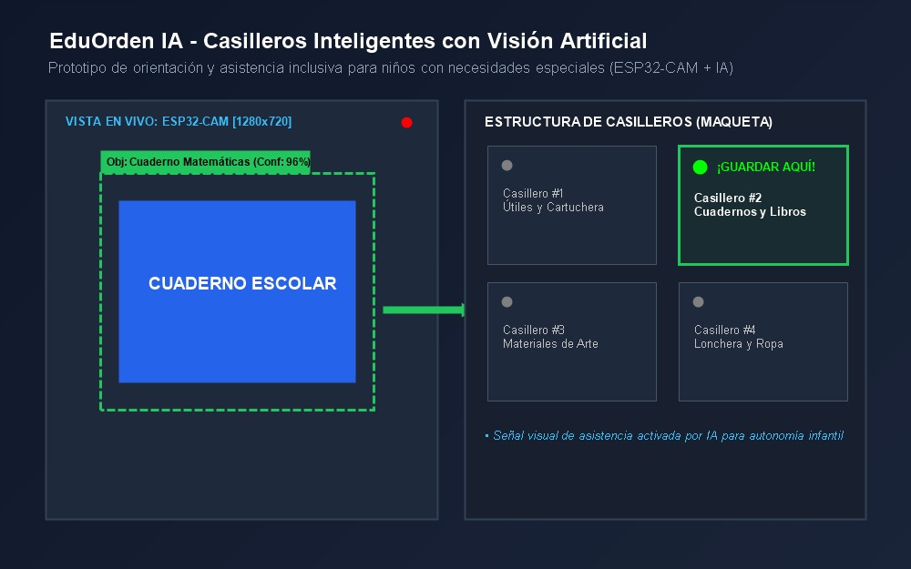
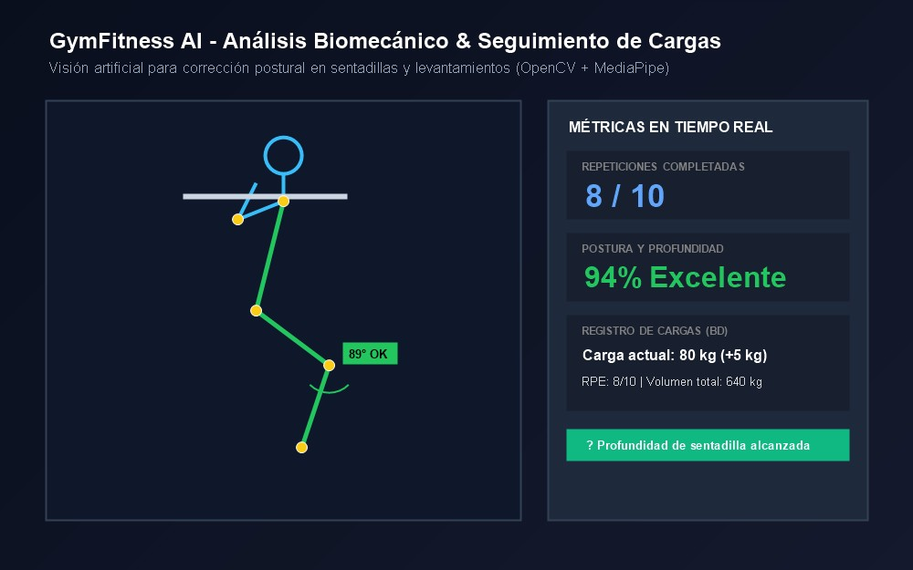

# Marlon Rainier Aguiño Salinas — Portafolio Profesional

Portafolio web desarrollado con tecnologías web estándar (**HTML5 semántico**, **CSS3 Vanilla** y **JavaScript ES6+**), enfocado en arquitectura de software limpia, diseño modular, accesibilidad web y alto rendimiento sin dependencias de frameworks externos.

---

## Ficha Técnica del Proyecto

| Parámetro | Detalle |
| :--- | :--- |
| **Desarrollador** | Marlon Rainier Aguiño Salinas |
| **Especialidad** | Ingeniería de Software |
| **Enfoque** | Desarrollo Web Full-Stack, Inteligencia Artificial y Sistemas Embebidos (IoT) |
| **Tecnologías Base** | HTML5, CSS3 (Variables CSS & Design Tokens), JavaScript ES6+ |
| **Arquitectura** | Modular por vistas independientes con enrutamiento de estado |
| **Compatibilidad** | Google Chrome, Mozilla Firefox, Microsoft Edge, Safari |
| **Repositorio** | [github.com/Marlonsaguino/Portafolio-.Tarea1](https://github.com/Marlonsaguino/Portafolio-.Tarea1) |
| **Despliegue** | [marlonsaguino.github.io/portafolio-web](https://marlonsaguino.github.io/portafolio-web/) |

---

## Galería Visual de Proyectos

A continuación se presentan las vistas principales del sistema. Cada imagen funciona como un enlace interactivo para explorar el proyecto desplegado o acceder a su repositorio técnico:

| Presentación & Perfil | GUIOSPRO FLOSS Web |
| :---: | :---: |
| [](https://marlonsaguino.github.io/portafolio-web/#inicio)<br><sub>**Marlon Rainier Aguiño Salinas** — Presentación profesional y métricas</sub> | [](https://marlonsaguino.github.io/portafolio-web/#proyectos)<br><sub>**GUIOSPRO FLOSS Web** — Diagnóstico FODA y Adopción de Software Libre</sub> |

| EduOrden IA | GymFitness Biomecánica |
| :---: | :---: |
| [](https://github.com/Marlonsaguino/EDUORDEN-IA)<br><sub>**EduOrden IA** — Casilleros Inteligentes con ESP32-CAM ([Repositorio](https://github.com/Marlonsaguino/EDUORDEN-IA))</sub> | [](https://marlonsaguino.github.io/portafolio-web/#proyectos)<br><sub>**GymFitness** — Corrección Postural en Tiempo Real con MediaPipe</sub> |

---

## Arquitectura del Sistema

El desarrollo sigue principios de ingeniería de software orientados a la mantenibilidad, escalabilidad y separación de responsabilidades:

### 1. Estructura y Semántica (HTML5)
- Uso de etiquetas semánticas (`<header>`, `<nav>`, `<main>`, `<section>`, `<article>`, `<dialog>`, `<footer>`) que optimizan la indexación SEO y el soporte para lectores de pantalla.
- Implementación de atributos de accesibilidad WAI-ARIA (`aria-expanded`, `aria-controls`, `aria-label`, `aria-modal`, `role="tab"`) en componentes interactivos complejos.
- Metadatos descriptivos en el `<head>`, Open Graph básico y carga asíncrona de tipografías optimizadas.

### 2. Capa de Presentación y Design System (CSS3)
- **Tokens de Diseño:** Centralización de variables CSS en `:root` que gobiernan colores primarios, secundarios, superficies, espaciados sistemáticos (`--space-xs` a `--space-xl`), bordes redondeados y sombras volumétricas.
- **Soporte Dinámico de Temas:** Conmutación entre Tema Oscuro (Obsidian/Zinc) y Tema Claro mediante selectores de atributo `[data-theme="light"]`, preservando contrastes que cumplen el estándar WCAG AA.
- **Efectos Visuales Avanzados:** Uso de *backdrop-filter (glassmorphism)* en barras flotantes, transiciones mediante curvas cúbicas de aceleración (`cubic-bezier(0.16, 1, 0.3, 1)`) y diseño adaptativo (*Mobile-First*) soportado en CSS Grid y Flexbox.
- **Accesibilidad Visual:** Integración de la directiva `@media (prefers-reduced-motion: reduce)` para usuarios sensibles a animaciones de movimiento.

### 3. Lógica de Interfaz y Control de Estado (JavaScript ES6+)
- **Navegación Modular:** Enrutador ligero que controla la activación y visibilidad de las secciones sin recargas de página, sincronizando el historial mediante la API de `History`.
- **Encabezado Auto-ocultable:** Sistema de detección coordinada que evalúa la dirección del scroll (aparición en scroll ascendente y ocultación tras retardo al descender) e incorpora una zona de activación perimetral en la franja superior (primeros 85 px) para revelar el menú por proximidad del cursor.
- **Filtrado Dinámico de Proyectos:** Algoritmo de filtrado por atributos `data-category` que manipula el DOM de forma reactiva con transiciones de entrada fluidas.
- **Ficha Técnica Modal Accesible:** Integración del elemento nativo `<dialog>`, con captura de eventos de teclado (`Escape`), foco atrapado y cierre por interacción fuera del contenedor.
- **Motor de Validación de Formularios:** Verificación en tiempo real mediante expresiones regulares para correo electrónico, control de longitudes mínimas y despliegue de mensajes contextuales asistidos por un sistema de notificaciones *Toast*.

---

## Módulos y Secciones del Portafolio

1. **Inicio:** Presentación profesional de ingeniería, estado de disponibilidad laboral, métricas de experiencia y llamadas a la acción directas hacia proyectos y perfil de GitHub.
2. **Sobre mí:** Trayectoria académica, pilares de ingeniería (código limpio, resolución con propósito real y autoaprendizaje continuo), enlaces de contacto directo y perfil profesional.
3. **Habilidades:** 
   - Grid interactivo de lenguajes (Python, JavaScript, TypeScript, SQL, Java, C/C++, HTML5/CSS3) clasificados por nivel de dominio.
   - Herramientas de desarrollo y entorno (Git, Docker, Linux, Postman, Figma).
   - Acordeones interactivos desglosados en tres áreas clave: Arquitectura Web, Backend & Datos, e Inteligencia Artificial / IoT.
4. **Proyectos:**
   - **GUIOSPRO FLOSS Web:** Plataforma para el diagnóstico de viabilidad y ponderación en la adopción de tecnologías de código abierto mediante análisis FODA automatizado.
   - **EduOrden IA:** Sistema mecatrónico a escala asistido por cámara ESP32-CAM y algoritmos de visión por computadora orientado a reforzar la autonomía de estudiantes con necesidades cognitivas especiales ([Repositorio en GitHub](https://github.com/Marlonsaguino/EDUORDEN-IA)).
   - **GymFitness Biomecánica:** Aplicación para la corrección postural en tiempo real mediante estimación cinemática de articulaciones corporales utilizando Python, OpenCV y MediaPipe.
5. **Design System:** Módulo de auditoría y documentación visual donde se exponen las paletas cromáticas, la escala tipográfica, la métrica de espaciados y componentes reutilizables reales (botones, insignias tecnológicas, campos de entrada).
6. **Contacto:** Datos de contacto formal y formulario interactivo con validación de datos.

---

## Estructura del Directorio

```text
Portafolio-.Tarea1/
├── index.html              # Documento raíz con marcado semántico HTML5
├── README.md               # Documentación técnica del proyecto
├── .gitignore              # Exclusiones de control de versiones
│
├── css/
│   └── styles.css          # Design System, variables CSS y estilos responsive
│
├── js/
│   └── script.js           # Lógica JavaScript, enrutador, navbar y controladores de eventos
│
└── images/
    ├── profile.jpg         # Fotografía de presentación profesional
    ├── guiospro.jpg        # Captura de interfaz GUIOSPRO FLOSS Web
    ├── eduorden.jpg        # Fotografía del prototipo EduOrden IA
    └── gymfitness.jpg      # Captura de pantalla del análisis en GymFitness
```

---

## Guía de Ejecución y Visualización

### Ejecución Local
No requiere instalación de dependencias, entornos virtuales ni empaquetadores externos:
1. Clonar el repositorio:
   ```bash
   git clone https://github.com/Marlonsaguino/Portafolio-.Tarea1.git
   ```
2. Abrir el archivo `index.html` en cualquier navegador web moderno.

### Acceso a la Versión Pública
El sitio se encuentra publicado y accesible a través de GitHub Pages:  
[https://marlonsaguino.github.io/portafolio-web/](https://marlonsaguino.github.io/portafolio-web/)

---

## Información de Contacto

- **Autor:** Marlon Rainier Aguiño Salinas
- **Correo Electrónico:** [bekaaguino@gmail.com](mailto:bekaaguino@gmail.com)
- **Perfil de GitHub:** [github.com/Marlonsaguino](https://github.com/Marlonsaguino)
- **Ubicación:** Milagro, Guayas, Ecuador
